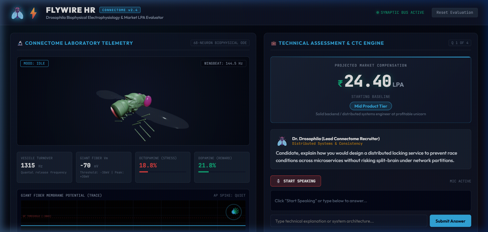

# FlyWire HR — Drosophila Connectome Real-Time LPA Interviewer 🪰⚡

A real-time technical mock interviewer powered by authentic *Drosophila melanogaster* connectome biophysics and micro-CT anatomy. The fly evaluates your systems architecture answers in real-time, projects your market compensation (LPA — Lakhs Per Annum) across Indian tech tiers, and exhibits emotional biophysical reactions (Giant Fiber escape jump, violent buzzing, happy grooming courtship dance).



---

## Key Highlights

- **Phase 2 Live LLM Neural Judge (Google AI Studio Gemini 1.5 Flash)**:
  - Supports entering a free Google AI Studio API key to unlock dynamic conversational grilling.
  - Generates structured biophysical tensors (`dopamineReward`, `octopamineStress`, `giantFiberTriggered`, `deltaLPA`).
  - Dynamically invents targeted follow-up questions based on the candidate's exact architectural claims.
  - Zero-break automatic fallback to local heuristic engine if API key is unconfigured.

- **Pure Biophysical Dynamical System (24 Coupled ODEs)**:
  - **Izhikevich Giant Fiber Escape Interneuron**: Real-time non-linear membrane potential ($V, u$) with canonical $+30\text{ mV}$ spike peak reset ($c = -60\text{ mV}, d = 8.0$):
    $\frac{dv}{dt} = 0.04v^2 + 5v + 140 - u + I_{\text{syn}}$
    $\frac{du}{dt} = a(bv - u)$
  - **Excitatory Conductance-Based Synapse**: $I_{\text{syn}} = g_{\text{syn}} \cdot y \cdot (E_{\text{rev}} - V)$ (strictly depolarizing inward drive at resting potential $-65\text{ mV}$).
  - **Tsodyks-Markram Short-Term Facilitation (STF)**: 3-pool vesicle dynamics (available $x$, active cleft $y$, refractory $z$) with strict mass conservation ($x + y + z = 1.0$) and activity-dependent release probability $u_{\text{rel}}$.
  - **Central Complex 16-Column Recurrent Ring Attractor**: 16 continuous coupled ODEs simulating Ellipsoid Body wedges with Mexican-hat lateral inhibition and continuous heading angle integration:
    $\tau_{\text{ring}} \frac{dr_i}{dt} = -r_i + f\left(\sum_j W_{ij} r_j + I_i^{\text{ext}}\right)$
  - **Michaelis-Menten Monoamine Kinetics**: Octopamine (stress/agitation) and Dopamine (reward/courtship) clearance:
    $\frac{d[X]}{dt} = S_{\text{stim}} \cdot k_{\text{rel}} - \frac{V_{\max} [X]}{K_m + [X]}$
  - Solved at $dt = 0.5\text{ ms}$ via Forward Euler integration with strict NaN clamps and numerical stability boundaries.

- **Authentic Janelia & FlyWire 3D Connectome Anatomy**:
  - **Janelia JRC2018 Unisex Template Brain**: Raided directly from `natverse/nat.flybrains` and rendered as a holographic glassmorphic neuropil shell.
  - **FlyWire & Hemibrain EM Reconstructed Neurons**: Raided from PyMaid FAFB and Hemibrain electron microscopy reconstructions (`24622.swc`, `1536947502.swc`, etc.) rendered as glowing axonal tracts with additive blending.
  - **Micro-CT Anatomy & 360° Interactive OrbitControls**: Sourced from `TuragaLab/flybody` adult Drosophila micro-CT models (`drosophila_head.obj`, `thorax.obj`, full 8-segment abdomen, 6 jointed legs, wings, and antennae). Fully rotatable and zoomable via OrbitControls with zero-allocation InstancedMesh action potential sparks.

- **Audio & Hardware Reliability**:
  - Native Web Speech API with automatic watchdog recovery.
  - **Audio Ducking**: Microphone input automatically mutes while the insect formant synthesizer speaks to eliminate acoustic feedback loops.
  - Tested at 60 FPS on NVIDIA RTX 2050 / Windows 11.

- **Isolated Multi-Tenancy & DoS Hardening**:
  - Per-connection session isolation in Socket.io (no shared state across concurrent candidate tabs).
  - Strict 4,000-character payload sanitization and submission debouncing.

- **Dynamic LPA Compensation & Tech Tiers**:
  - Real-time keyword & concept analysis maps answers to Indian Tech salary tiers:
    - `0.0 - 3.0 LPA`: Unpaid Chai Intern
    - `3.0 - 5.5 LPA`: Mass Recruiter Service Bench
    - `5.5 - 12.0 LPA`: Junior Startup Dev
    - `12.0 - 25.0 LPA`: Mid Product Tier
    - `25.0 - 48.0 LPA`: Tier-1 FinTech Lead
    - `48.0 - 95.0 LPA`: FAANG Staff Architect
    - `95.0 - 200.0+ LPA`: HFT Quant / Connectome Overlord
  - Immediate disqualification on non-technical confessions and heavy penalties on emotional begging.

---

## Quickstart

### Prerequisites
- Node.js 18+ (tested on Node.js v20+)
- Modern browser (Chrome / Edge recommended for Web Speech API support)

### Installation
```bash
# Clone the repository
git clone https://github.com/Nikhil-Vzo/Fruit-fly-interviewer.git
cd Fruit-fly-interviewer

# Install dependencies
npm install

# Run unit tests (23 passing biophysical, LPA, Gemini fallback, and multi-tenancy tests)
npm test

# Launch the server
npm start
```

Open `http://localhost:3000` in your browser.

---

## Project Structure

```
├── lib/
│   ├── biophysics-engine.js   # Izhikevich ODE, Tsodyks-Markram & monoamine kinetics
│   └── lpa-engine.js          # Salary tiers, concept scoring, and disqualification rubric
├── public/
│   ├── assets/                # Janelia brain OBJ, FlyWire neurons JSON, micro-CT meshes
│   ├── js/
│   │   ├── app.js             # Main reactive orchestrator
│   │   ├── biophysics-engine.js
│   │   ├── lpa-engine.js
│   │   ├── connectome-scene.js# Three.js 3D viewport & skeletal animation system
│   │   ├── speech-audio.js    # Speech STT, watchdog, audio ducking & insect synthesizer
│   │   └── telemetry-hud.js   # 60 FPS CRT oscilloscope & Central Complex polar ring
│   ├── index.html             # Laboratory CRT HUD interface
│   └── style.css              # Cyber-laboratory design system
├── tests/
│   ├── biophysics.test.js     # Membrane dynamics & numerical stability tests
│   └── lpa.test.js            # Rubric, begging penalties, & non-tech admission tests
└── server.js                  # Express static server + Socket.io biophysics telemetry bus
```

---

## License

MIT License. 3D brain templates and micro-CT meshes retain credit to Janelia Research Campus, FlyWire consortium, and TuragaLab.
