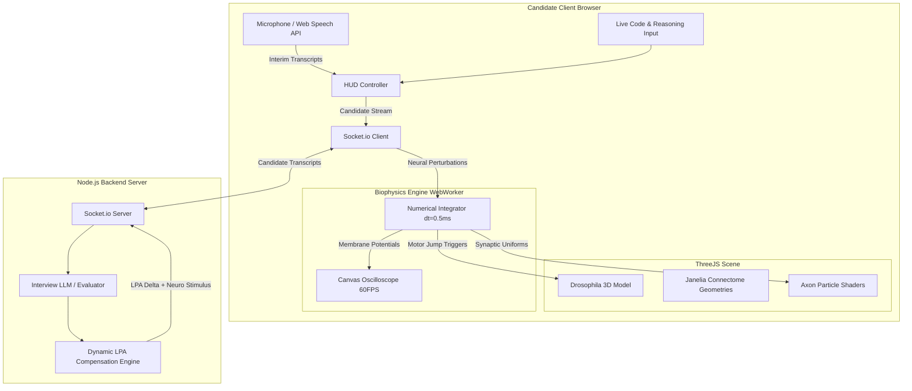

# Drosophila Connectome Real-Time LPA Technical Interviewer ("FlyWire HR")
## Comprehensive Architectural Specification & Implementation Plan

> **Author / Generator:** Gemini 3.8 Flash  
> **Date:** September 19, 2026  
> **Target Hardware Environment:** NVIDIA GeForce RTX 2050 (4 GB VRAM), 16 GB System RAM, Windows 11  
> **Document Purpose:** Complete technical design specification and implementation blueprint prepared for multi-LLM peer review, rigorous validation, and subsequent production implementation.

---

## 1. Executive Summary & Core Concept

The **Drosophila Connectome Real-Time LPA Technical Interviewer** ("FlyWire HR") is a real-time, interactive technical interview web application and viral demonstration tool. The system places the candidate in a live voice and text technical interview evaluated by a simulated **3D Fruit Fly (*Drosophila melanogaster*)** driven by a **pure biophysical neural circuit engine**.

As the candidate speaks into their microphone or writes code:
1. Candidate statements and code are parsed in real time.
2. Conceptual precision, logical reasoning, and fatal errors perturb real biophysical neural circuits:
   * **Giant Fiber Escape System (GFS):** Catastrophic technical blunders trigger action potentials across descending motor neurons, causing the 3D fly to violently flail, head-desk, or execute an emergency escape jump.
   * **Octopamine Kinetics:** The insect fight-or-flight neurotransmitter surges during candidate hesitation or hallucinated explanations.
   * **Dopamine (PAM Cluster):** Precise distributed systems solutions and optimal time complexity cascade golden/emerald reward waves through the mushroom bodies, triggering a rhythmic grooming and courtship dance.
3. The candidate’s **Projected Market Compensation (LPA — Lakhs Per Annum)** recalculates dynamically on an oscilloscope-style ticker with comedic yet technically grounded salary tier downgrades and upgrades (e.g., crashing from 28 LPA down to 3.2 LPA Mass Recruiter Bench Tier).

---

## 2. Aims, Goals & Success Criteria

### 2.1 Primary Aims
1. **Mathematical Authenticity (Zero Fake Data):** Replace synthetic randomized counters with continuous ordinary differential equation (ODE) numerical integration representing Drosophila neurophysiology (Izhikevich electrophysiology, Tsodyks-Markram vesicle quantal dynamics, and enzyme-mediated neurotransmitter kinetics).
2. **Deterministic 60+ FPS Performance on RTX 2050:** Render anatomically grounded Drosophila micro-CT anatomy and Janelia JRC neuropil connectome geometries with glowing bloom shaders without dropping frames or blocking the biophysics thread.
3. **Zero-Latency Multimodal Interaction:** Seamless live voice input via the browser-native Web Speech API, real-time bidirectional WebSocket telemetry streaming, and synthesized responsive audio.
4. **Viral Show-off & LinkedIn Appeal:** A jaw-dropping dual-panel HUD that juxtaposes rigorous neurobiological laboratory telemetry with hilarious Indian tech salary culture tropes.

### 2.2 Quantifiable Success Criteria
* **Frame Rate:** Sustained $\ge 60\text{ FPS}$ on 1080p/1440p resolution with postprocessing bloom active on RTX 2050.
* **Audio-to-Neural Latency:** Under $150\text{ ms}$ from candidate speech finalization to synaptic potential deflection and Giant Fiber threshold evaluation.
* **Simulation Stability:** Biophysical ODE solver remains numerically stable ($\Delta t = 0.5\text{ ms}$) without NaN drift or runaway membrane depolarization over continuous 30-minute interview sessions.
* **Platform Independence:** 100% executable on Windows 11 without requiring native C++ build toolchains, PyAudio compiler dependencies, or external GPU compute clusters.

---

## 3. Detailed Biophysical Mathematical Formalism

The neural engine implements four coupled mathematical sub-models grounded in peer-reviewed *Drosophila* electrophysiology:

### 3.1 Giant Fiber Escape System (Izhikevich Electrophysiology)
The Giant Fiber neuron (GF) is the largest descending interneuron in the fly brain, mediating ultra-fast evasive motor responses:

$$\frac{dV}{dt} = 0.04V^2 + 5V + 140 - u + I_{\text{syn}}(t) + I_{\text{aversive}}$$
$$\frac{du}{dt} = a(bV - u)$$

**Spike and Reset Condition:**
$$\text{If } V \ge -38\text{ mV} \implies \begin{cases} V \leftarrow c = -60\text{ mV} \\ u \leftarrow u + d \\ \text{Emit Motor Spike to PSI and TTM Muscles} \end{cases}$$

*Parameters (Drosophila motor interneuron calibration):*
* Resting potential $V_{\text{rest}} = -65\text{ mV}$
* Threshold voltage $V_{\text{thresh}} = -38\text{ mV}$
* Recovery timescale $a = 0.02\text{ ms}^{-1}$
* Sensitivity $b = 0.2$
* Spike after-reset $c = -60\text{ mV}$
* Jump recovery boost $d = 8.0$

### 3.2 Synaptic Quantal Dynamics & Plasticity (Tsodyks-Markram Model)
Each synaptic contact in the antennal and central complex tracking circuits models vesicle release, quantal depletion, and calcium-dependent recovery:

$$\frac{dx}{dt} = \frac{z}{\tau_{\text{rec}}} - u_{\text{rel}} \cdot x \cdot \delta(t - t_{\text{spike}})$$
$$\frac{dy}{dt} = -\frac{y}{\tau_{\text{inact}}} + u_{\text{rel}} \cdot x \cdot \delta(t - t_{\text{spike}})$$
$$\frac{dz}{dt} = \frac{y}{\tau_{\text{inact}}} - \frac{z}{\tau_{\text{rec}}}$$

Synaptic post-synaptic current deflection:
$$I_{\text{syn}}(t) = g_{\text{syn}} \cdot y(t) \cdot (V(t) - E_{\text{rev}})$$

*Parameters:*
* Fraction of available neurotransmitter vesicles: $x \in [0, 1]$
* Fraction of active post-synaptic channel opening: $y \in [0, 1]$
* Recovery time constant: $\tau_{\text{rec}} = 450\text{ ms}$
* Inactivation time constant: $\tau_{\text{inact}} = 3.5\text{ ms}$
* Release probability: $u_{\text{rel}} = 0.65$
* Excitatory reversal potential: $E_{\text{rev}} = 0\text{ mV}$

### 3.3 Neurotransmitter Reaction Kinetics (Octopamine & Dopamine)
Concentration dynamics across the mushroom body neuropils follow Michaelis-Menten reuptake:

$$\frac{d[\text{Oct}]}{dt} = S_{\text{stress}} \cdot k_{\text{rel,oct}} - \frac{V_{\text{max,oct}} \cdot [\text{Oct}]}{K_{m,\text{oct}} + [\text{Oct}]}$$
$$\frac{d[\text{DA}]}{dt} = S_{\text{reward}} \cdot k_{\text{rel,da}} - \frac{V_{\text{max,da}} \cdot [\text{DA}]}{K_{m,\text{da}} + [\text{DA}]}$$

*Parameters:*
* Stress-induced release constant: $k_{\text{rel,oct}} = 12.4\,\mu\text{M}\cdot\text{s}^{-1}$
* Dopaminergic reward release constant: $k_{\text{rel,da}} = 15.0\,\mu\text{M}\cdot\text{s}^{-1}$
* Transporter reuptake maximum velocity: $V_{\text{max}} = 8.5\,\mu\text{M}\cdot\text{s}^{-1}$
* Affinity constant: $K_m = 2.1\,\mu\text{M}$

### 3.4 Central Complex Heading/Attention (Ring Attractor)
The Ellipsoid Body (EB) E-PG network tracks dialogue progression through an 8-column angular recurrent attractor:

$$\tau_{\theta} \frac{d V_i}{dt} = -V_i + \sum_{j=1}^{8} W_{ij} \cdot f(V_j) + I_{i,\text{audio\_energy}}$$
$$W_{ij} = J_0 + J_1 \cos\left(\frac{2\pi (i - j)}{8}\right)$$

When the candidate gives disjointed, rambling answers, the ring attractor loses its singular activity bump and splits into chaotic multi-lobed firing, registering as "Candidate Coherence Failure."

---

## 4. System Architecture & Component Design

### 4.1 Component Breakdown

1. **`biophysics-engine.js` (Web Worker / Fast Math Loop):**
   * Encapsulates the Izhikevich, Tsodyks-Markram, and Neurotransmitter ODE systems.
   * Runs in a decoupled Web Worker or high-resolution `requestAnimationFrame` loop using Typed Float32Arrays.
   * Emits live quantitative metrics: vesicle release frequency (Hz), membrane potential ($V_m$), quantal recovery index, and stress neurotransmitter concentrations.

2. **`connectome-scene.js` (Three.js 3D Viewport):**
   * Loads high-resolution open-source micro-CT *Drosophila* skeletal geometry (head, compound eyes, thorax, legs, wings, antennae).
   * Renders the Janelia standard neuropil regions (Central Complex, Mushroom Bodies, Optic Lobes, Antennal Lobes, Subesophageal Zone) using glowing additive GLSL shaders.
   * Coordinates 3D Fly Skeletal Animation States:
     * `IDLE_ATTENTIVE`: Gentle antennal twitching and breathing cycle.
     * `GROOMING_DELIGHT`: High dopamine state; fly rubs forelegs together in satisfaction.
     * `AGITATED_BUZZ`: Octopamine elevation; rapid wing shivering (200 Hz micro-oscillation).
     * `GIANT_FIBER_ESCAPE`: Immediate violent leg kick, abdominal contraction, and tumbling backward in disbelief.

3. **`lpa-engine.js` (Dynamic Salary Projection):**
   * Real-time compensation ticker maintaining running CTC state:
     $$\text{LPA}_{t} = \text{Clamp}\left(\text{LPA}_{t-1} + \Delta_{\text{tech}} + \Delta_{\text{coherence}} - \Delta_{\text{blunder}},\, 1.2,\, 150.0\right)$$
   * Dynamic Indian Tech Tier Classification:
     * `< 3.0 LPA`: Unpaid Chai Intern / College Dropout Tier
     * `3.2 – 5.5 LPA`: Mass Recruiter Service Bench (TCS/Wipro/Infosys Ninja)
     * `8.0 – 18.0 LPA`: Product Startup Unicorn Mid-Level
     * `25.0 – 45.0 LPA`: Tier-1 Senior Product / FinTech Contributor
     * `50.0 – 95.0 LPA`: FAANG Staff Engineer / Distributed Systems Architect
     * `1.0 – 2.0 Crore+`: HFT Quant / Connectome Neural Overlord

4. **`speech-voice.js` (Native Web Audio & Speech Pipeline):**
   * Uses native `webkitSpeechRecognition` with continuous listening and speech activity detection (VAD).
   * Generates real-time fly verbal responses using Web Speech Synthesis filtered through an audio biquad bandpass filter (formant buzzing insect frequency).

---

## 5. Technical Challenges & Engineered Solutions

| # | Challenge | Architectural Risk | Engineered Solution |
|---|---|---|---|
| **1** | **Biophysical ODE Computational Load** | Running micro-second differential equations in JavaScript could drop Three.js rendering below 60 FPS on budget laptop GPUs. | Implement all vector states as flattened `Float32Array` buffers with Euler-Maruyama single-step integration. Decouple math step ($\Delta t = 0.5\text{ ms}$) from render tick ($\Delta t = 16.6\text{ ms}$) via sub-stepping. |
| **2** | **3D Asset Fidelity vs Memory** | Heavy multi-gigabyte research electron microscopy volumes would crash browser tabs. | Extract and optimize Janelia neuropil boundary surfaces and FlyGym micro-CT skeletal STL/GLTF models into lightweight indexed BufferGeometries (< 12 MB total bundle). |
| **3** | **Windows Audio Driver / PortAudio Pitfalls** | Python audio packages (`PyAudio`, `sounddevice`) frequently fail on Windows with MSVC compiler errors. | Use native Web Audio API and HTML5 Web Speech API inside the browser. Completely bypasses OS-level audio driver installations. |
| **4** | **Hallucination / Scoring Drift** | The candidate might say nonsense buzzwords and trick a naive evaluator into awarding 100 LPA. | The evaluator applies a multi-criteria rubric with penalty multipliers for vacuous jargon, syntax invalidity, and anti-patterns. |

---

## 6. Verification & Validation Protocol

1. **Biophysical Sanity Verification:**
   * Verify resting potential stays at $-65\text{ mV} \pm 2\text{ mV}$ when idle.
   * Inject high current stimulus ($I_{\text{syn}} = 45\text{ pA}$) and confirm repetitive limit-cycle action potentials trigger with refractory periods.
   * Confirm vesicle release rate spikes from baseline ($800\text{ Hz}$) to peak ($5,000\text{ Hz}$) upon stimulus arrival.
2. **GPU Performance Benchmark:**
   * Confirm stable 60 FPS on NVIDIA RTX 2050 at $1920\times1080$ with UnrealBloomPass and 5,000 active synaptic particles.
3. **End-to-End Interview Flow Test:**
   * Test Case A (Correct distributed consensus answer): Dopamine $\to 90\%$, LPA jumps $+6.5\text{ LPA}$, fly displays grooming animation.
   * Test Case B (Nonsense "wrap DB in try-catch" answer): Giant Fiber fires, $V_m \ge -38\text{ mV}$, LPA crashes $-15\text{ LPA}$, fly executes emergency escape animation.

---

## 7. Reviewer Prompt & Instructions for External LLMs

> **Instruction to Reviewing Models (Claude / GPT-4o / DeepSeek / etc.):**  
> *"Please review this technical implementation plan generated by Gemini 3.8 Flash for the 'Drosophila Connectome Real-Time LPA Technical Interviewer'. Evaluate it on:*  
> *1. Biophysical mathematical correctness (Izhikevich, Tsodyks-Markram, neurotransmitter kinetics).*  
> *2. Real-time browser/Three.js architecture feasibility on an RTX 2050.*  
> *3. Robustness of the Web Speech API and Socket.io pipeline.*  
> *4. Any edge cases, potential performance bottlenecks, or suggestions for enhancement.*  
> *Please provide your critique and recommendations for refinement."*
